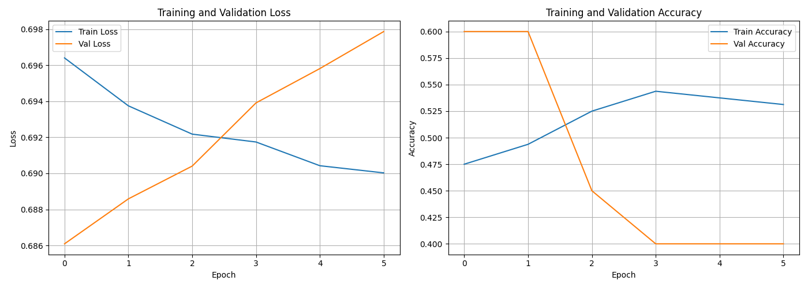
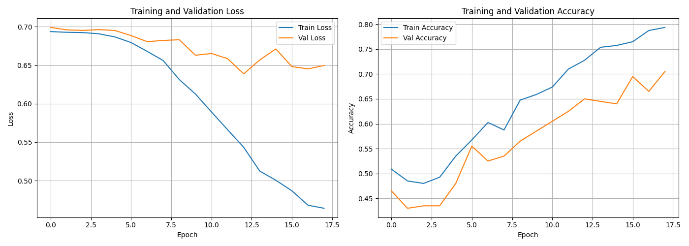
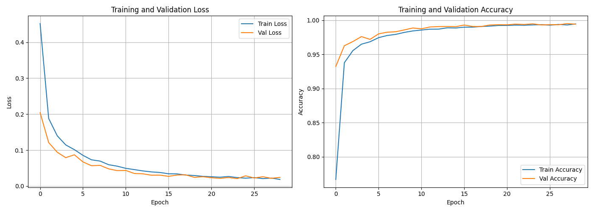

# A vanilla RNN to recognize Palindrome Numbers
LI, Haofang
21152428, hligi@connect.ust.hk

## Training log:
#### \# data:200

#### \# data:1000

#### \# data:50000

### Hyperparameters and logs:
[training log with 200](logs/training_log_200.json)

[training log with 1000](logs/training_log_1000.json)

[training log with 50000](logs/training_log_50000.json)

## How to run test:
Run `evaluate.py` directly, with `test.csv` lies under the same directory.
Or run `evaluate.py <dir to csv file>`