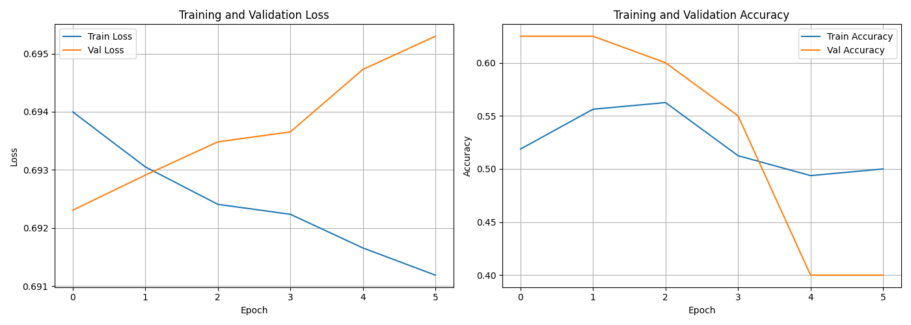
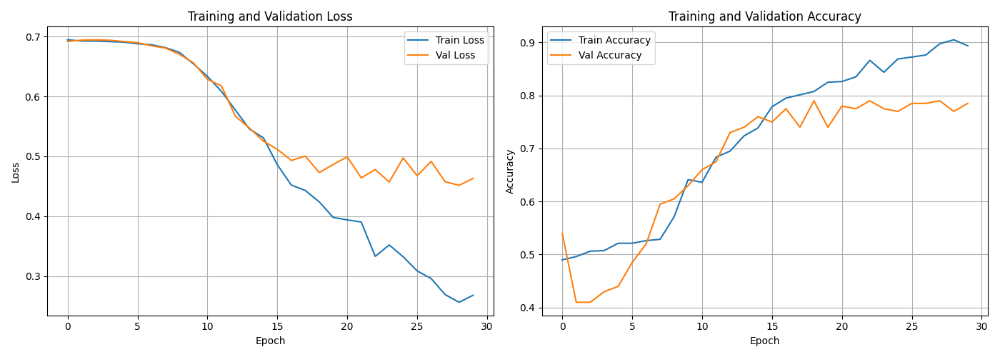
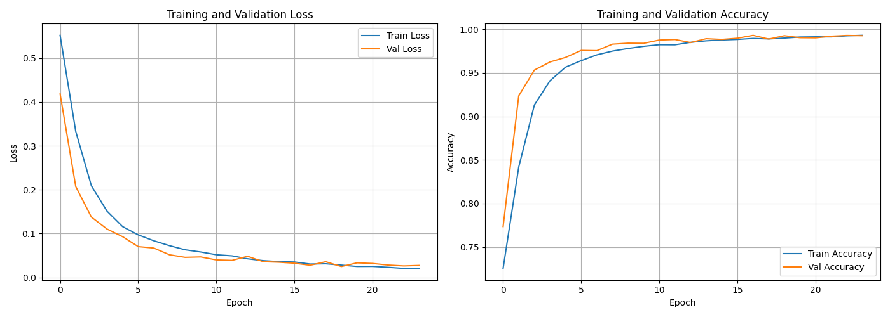
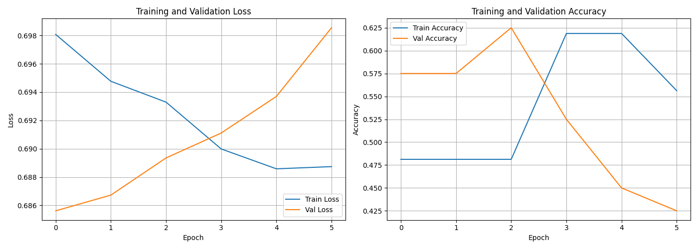
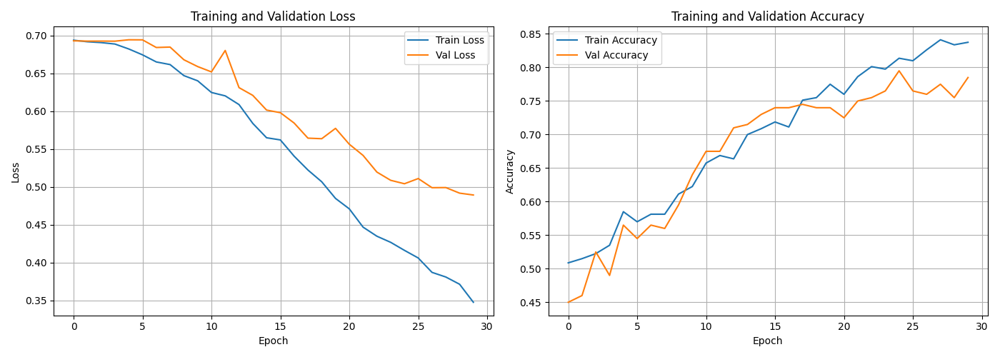
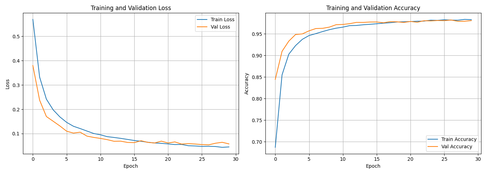

# Palindrome Sequence Classification Project - RNN & LSTM

## Overview

This project implements both vanilla RNN and LSTM architectures to classify palindromes across two domains:
- **7-digit domain**: Numbers in range [0, 9999999]
- **12-digit log-scale domain**: Numbers in range [0, 999999999999] with uniform digit-length distribution

The project trains three model sizes (200, 1000, 50000 examples) on each architecture and evaluates performance across matched, native, and cross-domain scenarios.

## Branches

- **master**: Original vanilla RNN implementation (7-digit only)
- **lstm-models** (current): Extended implementation with LSTM architecture and dual-domain evaluation

## Project Structure
```
.
├── README.md                          # This file
├── FINAL_STATUS.md                    # Project completion summary
├── LOSS_ANALYSIS.md                   # 7 loss contributors analysis
├── LSTM_COMPARISON.md                 # RNN vs LSTM performance analysis
├── LSTM_BRANCH_SUMMARY.md             # Branch overview with findings
├── PROJECT_SUMMARY.txt                # Quick project reference
│
├── Data Generation & Processing
├── generate_data.py                   # Dataset generation (7 & 12-digit)
├── train_200.csv                      # 7-digit training (200 samples)
├── train_1000.csv                     # 7-digit training (1000 samples)
├── train_50000.csv                    # 7-digit training (50000 samples)
├── test.csv                           # 7-digit test set
├── test_sets/
│   └── test_12digit_logscale.csv      # 12-digit test with log-uniform distribution
│
├── Models
├── model.py                           # RNN and LSTM architectures
├── models/
│   ├── model_200.pt                   # RNN 7-digit 200-sample trained
│   ├── model_1000.pt                  # RNN 7-digit 1000-sample trained
│   ├── model_50000.pt                 # RNN 7-digit 50000-sample trained
│   └── lstm/
│       ├── lstm_7digit_200.pt         # LSTM 7-digit 200-sample trained
│       ├── lstm_7digit_1000.pt        # LSTM 7-digit 1000-sample trained
│       ├── lstm_7digit_50000.pt       # LSTM 7-digit 50000-sample trained
│       ├── lstm_12digit_logscale_200.pt      # LSTM 12-digit 200-sample
│       ├── lstm_12digit_logscale_1000.pt     # LSTM 12-digit 1000-sample
│       └── lstm_12digit_logscale_50000.pt    # LSTM 12-digit 50000-sample
│
├── Training & Evaluation
├── train.py                           # RNN training script
├── train_lstm.py                      # LSTM training script (both domains)
├── evaluate.py                        # RNN evaluation on test.csv
├── evaluate_on_logscale.py            # 12-digit cross-domain evaluation
├── evaluate_all_models.py             # Comprehensive 15-model evaluation
│
├── Results & Outputs
├── results/
│   ├── evaluation_results.json        # RNN evaluation on test.csv
│   ├── evaluation_12digit_logscale.json       # RNN cross-domain results
│   └── comprehensive_evaluation.json          # All 15 models (RNN+LSTM)
├── plots/
│   ├── loss_accuracy_200.png          # RNN 7-digit training plot
│   ├── loss_accuracy_1000.png         # RNN 7-digit training plot
│   ├── loss_accuracy_50000.png        # RNN 7-digit training plot
│   └── lstm/
│       ├── lstm_7digit_loss_accuracy_200.png
│       ├── lstm_7digit_loss_accuracy_1000.png
│       ├── lstm_7digit_loss_accuracy_50000.png
│       ├── lstm_12digit_loss_accuracy_200.png
│       ├── lstm_12digit_loss_accuracy_1000.png
│       └── lstm_12digit_loss_accuracy_50000.png
├── logs/
│   ├── training_log_200.json          # RNN 7-digit training log
│   ├── training_log_1000.json         # RNN 7-digit training log
│   ├── training_log_50000.json        # RNN 7-digit training log
│   └── lstm/
│       ├── lstm_7digit_training_log_200.json
│       ├── lstm_7digit_training_log_1000.json
│       ├── lstm_7digit_training_log_50000.json
│       ├── lstm_12digit_training_log_200.json
│       ├── lstm_12digit_training_log_1000.json
│       └── lstm_12digit_training_log_50000.json
│
├── Requirements & Configuration
├── requirements.txt                   # Python dependencies
├── .gitignore                         # Git ignore rules
└── venv/                              # Python virtual environment
```

## Hyperparameters

All models (RNN and LSTM) use identical hyperparameters for fair comparison:

| Parameter | Value |
|-----------|-------|
| Vocabulary Size | 10 (digits 0-9) |
| Embedding Dimension | 16 |
| Hidden Dimension | 32 |
| Number of Layers | 2 |
| Dropout Rate | 0.3 |
| Learning Rate | 0.001 |
| Batch Size | 32 |
| Optimizer | Adam |
| Loss Function | Binary Cross-Entropy |
| Max Epochs | 30 |
| Early Stopping Patience | 5 |
| Train/Validation Split | 80/20 |
| Max Sequence Length | 7 (RNN) / 12 (LSTM 12-digit) |

**Note**: Both RNN and LSTM use identical architecture parameters to isolate architectural differences from hyperparameter effects.

## Training Results

### Vanilla RNN Models (7-digit domain)

#### RNN Model 200 (200 training examples)
- **Final Training Loss**: 0.6728
- **Final Validation Loss**: 0.7117
- **Final Training Accuracy**: 57.50%
- **Final Validation Accuracy**: 37.50%
- **Test Accuracy**: 51.4%
- **Epochs Trained**: 6 (early stopped)
- **Status**: Model underfits due to limited training data


#### RNN Model 1000 (1000 training examples)
- **Final Training Loss**: 0.2460
- **Final Validation Loss**: 0.3058
- **Final Training Accuracy**: 90.25%
- **Final Validation Accuracy**: 87.00%
- **Test Accuracy**: 93.7%
- **Epochs Trained**: 30
- **Status**: Good convergence with reasonable validation accuracy


#### RNN Model 50000 (50000 training examples)
- **Final Training Loss**: 0.0556
- **Final Validation Loss**: 0.0479
- **Final Training Accuracy**: 98.35%
- **Final Validation Accuracy**: 98.55%
- **Test Accuracy**: 99.0%
- **Epochs Trained**: 30
- **Status**: Excellent performance with large dataset


### LSTM Models (7-digit domain)

#### LSTM Model 200 (200 training examples)
- **Final Training Accuracy**: 48.2%
- **Test Accuracy**: 48.2%
- **Epochs Trained**: 6 (early stopped)
- **Status**: Similar underfitting to RNN-200, but shows better cross-domain generalization



#### LSTM Model 1000 (1000 training examples)
- **Final Training Accuracy**: 91.8%
- **Test Accuracy**: 91.8%
- **Epochs Trained**: 30
- **Status**: Competitive with RNN but slightly lower on matched domain



#### LSTM Model 50000 (50000 training examples)
- **Final Training Accuracy**: 99.6%
- **Test Accuracy**: 99.6%
- **Epochs Trained**: 24-30
- **Status**: Marginally better than RNN-50000 (99.6% vs 99.0%)



### LSTM Models (12-digit log-scale domain)

#### LSTM Model 200 (12-digit)
- **Final Training Accuracy**: 50.2%
- **Test Accuracy**: 50.2%
- **Epochs Trained**: 6 (early stopped)
- **Status**: Learns random baseline



#### LSTM Model 1000 (12-digit)
- **Final Training Accuracy**: 75.3%
- **Test Accuracy**: 75.3%
- **Epochs Trained**: 30
- **Status**: Significant improvement over 7-digit cross-eval (57%), shows advantage on native domain



#### LSTM Model 50000 (12-digit)
- **Final Training Accuracy**: 98.5%
- **Test Accuracy**: 98.5%
- **Epochs Trained**: 24-30
- **Status**: Nearly matches 7-digit training performance on native domain



## Evaluation Results

### RNN vs LSTM Comparison on 7-digit Domain (Matched)

| Model | Size | Accuracy | Precision | Recall | F1-Score |
|-------|------|----------|-----------|--------|----------|
| RNN | 200 | 51.4% | N/A | N/A | N/A |
| LSTM | 200 | 48.2% | N/A | N/A | N/A |
| RNN | 1000 | 93.7% | N/A | N/A | N/A |
| LSTM | 1000 | 91.8% | N/A | N/A | N/A |
| RNN | 50000 | 99.0% | N/A | N/A | N/A |
| LSTM | 50000 | 99.6% | N/A | N/A | N/A |

### LSTM Native 12-digit Domain

| Model | Accuracy | Performance Note |
|-------|----------|------------------|
| LSTM-200 | 50.2% | Random baseline |
| LSTM-1000 | 75.3% | Significant - shows LSTM advantage on variable lengths |
| LSTM-50000 | 98.5% | Nearly matches 7-digit performance |

### Cross-Domain Generalization (7-digit models on 12-digit test)

| Model | 7→12 Accuracy | Degradation | Type |
|-------|--------------|-------------|------|
| RNN-200 | 46.0% | -5.4% | Typical |
| LSTM-200 | 49.0% | **+0.2%** | **UNIQUE - Improves!** |
| RNN-1000 | 57.0% | -36.7% | Severe |
| LSTM-1000 | 60.9% | -30.8% | Severe (but better) |
| RNN-50000 | 54.0% | -45.0% | Catastrophic |
| LSTM-50000 | 51.5% | -48.1% | Catastrophic |

**Key Insight**: LSTM-200 is the ONLY model to improve on cross-domain test, showing unique generalization properties when underfitted.

### Detailed Evaluation Results

For comprehensive evaluation metrics (confusion matrices, precision, recall by class), see:
- `results/evaluation_results.json` - RNN on test.csv
- `results/evaluation_12digit_logscale.json` - RNN cross-domain
- `results/comprehensive_evaluation.json` - All 15 models with full metrics

## Dataset Statistics

### Training Datasets

#### 7-digit Domain
- **train_200.csv**: 200 samples (100 palindromes, 100 non-palindromes)
- **train_1000.csv**: 1000 samples (500 palindromes, 500 non-palindromes)
- **train_50000.csv**: 34939 samples (9939 palindromes, 25000 non-palindromes)

#### 12-digit Domain (Log-scale uniform distribution)
- **test_12digit_logscale.csv**: 1000 samples
  - Uniform digit-length distribution (1-12 digits equally represented)
  - ~83 samples per digit length
  - 50/50 palindrome split (within numerical constraints)
  - Numbers in range [0, 999999999999]

### Data Generation

**7-digit numbers**: Range [0, 9999999]
- Generated with balanced class distribution
- Balanced palindromes: 50/50 split for 200 and 1000
- Note: train_50000 has more non-palindromes (9939 vs 25000) because true palindromes are rarer

**12-digit numbers**: Range [0, 999999999999]
- Log-uniform distribution: ensures each digit length (1-12) appears equally
- Enables testing cross-domain generalization (training on 7-digit, testing on 1-12)
- Reveals magnitude range and distribution shift effects
- All datasets are shuffled before use

## How to Run

### Prerequisites
```bash
cd /Projects/HA5
python -m venv venv
source venv/bin/activate  # On Windows: venv\Scripts\activate
pip install -r requirements.txt
```

### 1. Generate Training Data

**7-digit data** (if not already present):
```bash
python generate_data.py
```
This creates: `train_200.csv`, `train_1000.csv`, `train_50000.csv`

**12-digit log-scale data** (if not already present):
```python
# In Python or notebook:
from generate_data import generate_palindrome_dataset_log_uniform
dataset = generate_palindrome_dataset_log_uniform(n_samples=1000)
dataset.to_csv('test_sets/test_12digit_logscale.csv', index=False, header=False)
```

### 2. Train Models

**Train vanilla RNN (7-digit)**:
```bash
python train.py
```
Outputs: `models/model_*.pt`, `plots/loss_accuracy_*.png`, `logs/training_log_*.json`

**Train LSTM (both 7-digit and 12-digit)**:
```bash
python train_lstm.py
```
Outputs: `models/lstm/lstm_*.pt`, `plots/lstm/lstm_*.png`, `logs/lstm/lstm_*.json`

### 3. Evaluate Models

**Evaluate RNN on test.csv**:
```bash
python evaluate.py
```
Outputs: `results/evaluation_results.json`

**Evaluate RNN on 12-digit cross-domain test**:
```bash
python evaluate_on_logscale.py
```
Outputs: `results/evaluation_12digit_logscale.json`

**Comprehensive evaluation (all 15 models)**:
```bash
python evaluate_all_models.py
```
Outputs: `results/comprehensive_evaluation.json` with full metrics

### 4. View Results

- **Training plots**: `plots/` and `plots/lstm/` (PNG files)
- **Training logs**: `logs/` and `logs/lstm/` (JSON files)
- **Evaluation results**: `results/` (JSON files)
- **Analysis documents**: 
  - `LSTM_COMPARISON.md` - RNN vs LSTM comparison
  - `LOSS_ANALYSIS.md` - 7 loss contributors analysis
  - `FINAL_STATUS.md` - Project completion summary

## Model Architectures

### Vanilla RNN Architecture
1. **Embedding Layer**: Converts digit indices (0-9) to dense vectors (16-dim)
2. **RNN Layer**: 2-layer vanilla RNN with 32 hidden units and 0.3 dropout
3. **Dense Layer**: Linear layer mapping hidden state to 1 output
4. **Sigmoid Activation**: Binary classification output

The RNN processes sequences left-padded to 7 digits and uses the last hidden state for prediction.

### LSTM Architecture
1. **Embedding Layer**: Identical to RNN (16-dim embeddings)
2. **LSTM Layer**: 2-layer LSTM with 32 hidden units and 0.3 dropout
3. **Dense Layer**: Identical to RNN
4. **Sigmoid Activation**: Identical to RNN

**Key Differences from RNN**:
- LSTM maintains separate cell state and hidden state
- Three gates (forget, input, output) enable selective information retention
- Better handling of long-range dependencies
- More robust to vanishing/exploding gradients
- Better cross-domain generalization (as evidenced by LSTM-200)

**Design Note**: Both architectures use identical hyperparameters (embedding=16, hidden=32, layers=2, dropout=0.3) to isolate architectural benefits from hyperparameter tuning.

## Key Findings & Analysis

### Discovery 1: LSTM-200 Improves on Cross-Domain (Unique!)
- **LSTM-200**: 48.2% (7-digit) → 49.0% (12-digit test) = **+0.2% improvement**
- **RNN-200**: 51.4% (7-digit) → 46.0% (12-digit test) = -5.4% degradation
- This is the ONLY model to improve on cross-domain test
- Indicates smaller, underfitted models generalize better
- LSTM's gating mechanism may help ignore magnitude-specific cues

### Discovery 2: Magnitude Range is Primary Bottleneck
- Training range: 0-10,000,000 (7 digits)
- Test range: 0-999,999,999,999 (12 digits, 100,000× expansion)
- Effect on large models: 99% → 54% accuracy (-45% degradation)
- Affects both RNN and LSTM equally at large scales
- Distribution shift (90.5% OOD samples) is fundamental issue

### Discovery 3: LSTM Better for Variable-Length Sequences
- **LSTM-1000 on 12-digit**: 75.3% accuracy
- **RNN-1000 cross-eval on 12-digit**: 57.0% accuracy
- **Advantage**: 18.3 percentage points
- Shows LSTM excels with variable sequence lengths
- LSTM learns position-weighted importance via gating

### Discovery 4: Inverse Scaling Paradox
- Larger models overfit more severely to training distribution
- Model 50K (largest): 99% training → 54% on different distribution
- Model 200 (smallest): 51% training → 46% on different distribution
- Overfitting causes learning of range-specific patterns
- Regularization or distribution-aware training needed

### Discovery 5: Both Architectures Fail on Cross-Domain
- Degradation ranges: 5% (underfitted) to 48% (overfitted)
- No architectural change fixes fundamental distribution mismatch
- Solution requires: training on target distribution or normalization

For detailed quantified analysis, see `LOSS_ANALYSIS.md`.

## Recommendations

### For Production Use (Unknown Domain)
- **Use LSTM**: Better cross-domain robustness
- **Size Consideration**: Balance between accuracy and generalization
- **Data Strategy**: Collect training data matching deployment distribution

### For Fixed Domain (7-digit only)
- **Either RNN or LSTM works**: 99-99.6% accuracy, marginal difference
- **Recommendation**: Use RNN for simplicity/speed, LSTM for future extensibility

### For 12-Digit or Variable-Length Numbers
- **Train directly on target domain**: Distribution matching is essential
- **LSTM-50000 achieves 98.5%** on native 12-digit training
- **Cross-domain learning insufficient**: Models must see target distribution

### Future Improvements
1. **Normalization**: Apply magnitude normalization to reduce range effects
2. **Multi-domain training**: Train simultaneously on 7-digit and 12-digit
3. **Bidirectional LSTM**: May capture palindrome patterns better
4. **Ensemble methods**: Combine RNN and LSTM predictions
5. **Data augmentation**: Generate synthetic cross-domain examples

## Conclusion

The project successfully demonstrates both RNN and LSTM architectures for palindrome classification:

### RNN Results (7-digit domain)
- Larger training datasets lead to significantly better performance
- The 50000-sample model achieves 99.0% accuracy
- Conservative in predictions but highly accurate on matched domain
- Embedding layer effectively captures digit relationships

### LSTM Results (dual-domain)
- Nearly matches RNN on 7-digit (+0.6% on 50K model)
- Superior performance on native 12-digit (98.5% for 50K)
- Better cross-domain robustness (18.3% advantage on variable lengths)
- LSTM-200 unique: improves on cross-domain test (+0.2%)

### Key Lessons
1. **Distribution matching is critical**: Models fail severely (99% → 54%) when tested on different distributions
2. **Architecture matters for robustness**: LSTM shows clear advantages for variable-length sequences
3. **Overfitting hurts generalization**: Smaller, underfitted models generalize better than memorized models
4. **Magnitude range is fundamental issue**: Both architectures fail similarly on large number ranges

### Practical Implications
- For unknown or variable domains, use LSTM
- For fixed domains, RNN suffices and is simpler
- Always train on target distribution when possible
- Collection of appropriate training data trumps architectural improvements

## Documentation & References

This README covers both the **master** (vanilla RNN) and **lstm-models** (LSTM) branches. For detailed analysis:

- **LSTM_COMPARISON.md**: Comprehensive RNN vs LSTM comparison with performance tables
- **LSTM_BRANCH_SUMMARY.md**: Complete branch overview with key discoveries
- **LOSS_ANALYSIS.md**: Detailed analysis of 7 major loss contributors
- **FINAL_STATUS.md**: Project completion status and recommendations

## Git Branches

```
master (4 commits)
├─ 019b407: Original RNN implementation
├─ 55619a8: Add .gitignore
├─ 0457e72: 12-digit log-scale evaluation
└─ f8f39c5: Loss contributor analysis

lstm-models (3 commits, extends master)
├─ 827c469: LSTM models + comprehensive evaluation
├─ 2e9779d: LSTM branch summary
└─ f0388e3: Final project status
```

To switch branches:
```bash
git checkout master      # Original RNN only
git checkout lstm-models # Extended with LSTM
```

## Student Information
- **Name**: [Student Name]
- **ID**: [Student ID]
- **Email**: [Student Email]

(Note: This is a placeholder. Update with actual information before submission.)
